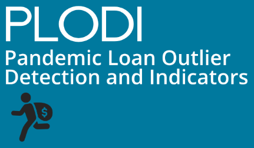
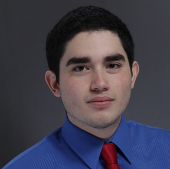

**[Background](#background)**  **[Loan Dashboard](#dashboard)**  **[Architecture](#architecture)**  **[Modeling](#modeling)**  **[Results](#results)**  **[About Us](#aboutus)**

## Background {#background}

To support businesses during the COVID-19 pandemic, the US Small Business Administration disbursed $1.2T of loans which were backed by the US government. Due to the rapid pace at which these loans were processed, many normal risk practices were relaxed, and consequently many instances of fraud have been identified with estimates of fraudulent loans ranging from $100B-$200B ([Link](https://www.sba.gov/document/report-23-09-covid-19-pandemic-eidl-ppp-loan-fraud-landscape)).

In this project, we developed machine learning models to identify risk factors for potentially fraudulent PPP loans and ranked all loans by these risk factors and the potential monetary recovery. This ranking can guide further development for identification of fraud indicators and investigation priority for regulatory agencies, guidance for loan screening for future loan programs, and supports open access to government spending for journalists and interested public individuals

## Dashboard for Ranked Loans {#dashboard}

([Link Here](https://fwgmq3bk6p.us-east-1.awsapprunner.com/))
Three dashboards are included:
1. Ranked loan data with key features ([Link Here](https://fwgmq3bk6p.us-east-1.awsapprunner.com/app/3)). In this dashbord, we provide two rankings suspicion_rank and suspicion_rank_weighted which are derived from the predicted probability of suspicion and the probability of suspicion interacted with the loan amount. We created a weighted ranking to account for differing loan amounts under the theory that regulators may want to focus on higher value loans for the purposes of maximizing recovery.
   
3. Slides with more background information and detail ([Link Here](https://fwgmq3bk6p.us-east-1.awsapprunner.com/app/1))
4. Data dictionary ([Link Here](https://fwgmq3bk6p.us-east-1.awsapprunner.com/app/2))

Github ([Link Here](https://github.com/s-chadalavada/plodi/)), Dashboard Github ([Link Here](https://github.com/roberto-saldivar/MIDS_210_RS/tree/main))

## Results & Impact {#results}

When using our champion XGBoost model and looking at the most suspicious loans, our model has very strong performance with the top 5-16% of loans getting correctly classified at rates of 98-89% respectively. Given the scale of the PPP loan program and resourcing constraints, machine learning could guide expert review by providing a ranking.

The most important features for our champion model are implied employee pay measures and location. Implied employee pay as measured by pay ratio is the most important feature while geographic information (cd_cat congressional district and SBA office code) are also highly important.

We see that suspect loans, those associated with an DOJ case, have a higher average pay ration compared to non-suspect loans. Pay Ratio is calculated as average_employee_pay to the average pay by NAICs code and state withthin the CBSA data to allow for pay normalization across geography and industry.

## Data

Primary Data: 9.1M PPP loans from the SBA ([Link here](https://www.sba.gov/funding-programs/loans/covid-19-relief-options/paycheck-protection-program/ppp-data))

Secondary Data: 
* USPS API - To validate applicant’s address under the theory invalid addresses are suspicions (feature engineering)
* NAICs Codes & CBSA Data - Census data by region and industry to determine normalized implied pay (feature engineering)
* Case Data - We reviewed and labelled 108 adjudicated DOJ cases. 108 cases. 614 individual and company names yielding 752 unique loans. Assume that a loan is “suspect” if it’s associated with one of the cases (data labelling)

## Modeling & Methodology {#modeling}
We assume a true fraud rate of 8% as estimates range from $70B-$200B1 of the $1.2T disbursed. All models are trained/tested on 9.4k loans, via downsampling of the non-case related loans, and assumed to be non-suspect. Train and Test split of 80% and 20% respectively. Given prosecuted cases are positive loan labels but remaining loans are unknown status. Therefore we weigh Recall (Sensitivity)  and Negative Predictive Value as primary measures for MVP model selection.

Based on the results from our test data, we selected XGBoost as our champion model as it outperformed relative to our other models (see slides linked below for more detail).

## Architecture {#architecture}
We leveraged AWS and GCP for data cleaning, modelling, and ranking. We then saved our loan level results to an AWS S3 bucket for our dashbord to easily access. To create our dashboard, we opted for a python based framework called [Mercury](https://runmercury.com/) to query and display our champion model results.

## About Us {#aboutus}
This project was completed in Fall 2023 as part of the UC Berkeley MIDS W210 Session 9 Capstone. The team consists of the followoing UC Berkeley MIDS students from left to right: 

Roberto Salvidar - [roberto_saldivar@ischool.berkeley.edu](roberto_saldivar@ischool.berkeley.edu), Crystal Chen - [crystalqianchen@ischool.berkeley.edu](crystalqianchen@ischool.berkeley.edu), Mike Varner - [mike_varner@ischool.berkeley.edu](mike_varner@ischool.berkeley.edu), and Sridhar Chadalavada - [sridhar@ischool.berkeley.edu](sridhar@ischool.berkeley.edu)

|                |       | 
|:--------------:|:-----:|
|  |  | 
| Sridhar Chadalavada - [sridhar@ischool.berkeley.edu](sridhar@ischool.berkeley.edu) | Crystal Chen - [crystalqianchen@ischool.berkeley.edu](crystalqianchen@ischool.berkeley.edu) |
|  |  |
| Roberto Salvidar - [roberto_saldivar@ischool.berkeley.edu](roberto_saldivar@ischool.berkeley.edu) | Mike Varner - [mike_varner@ischool.berkeley.edu](mike_varner@ischool.berkeley.edu) |

|              |  |  |
|:--------------|:-----:|:-----------|
|  | Sridhar Chadalavada | [sridhar@ischool.berkeley.edu](sridhar@ischool.berkeley.edu) |
|  | 1.89 |          6 |
|  | 1.89 |          6 |
|  | 1.89 |          6 |

   

#### Acknowledgments
We’d like to thank Daniel Aranki and Puya Vahabi, our course instructors, for their excellent guidance and feedback throughout the semester. We also want to thank Dakota Sky Potere-Ramos for working with us to identify and mitigate data privacy and ethics risks. Lastly, the authors of [Did FinTech Lenders Facilitate PPP Fraud?](https://onlinelibrary.wiley.com/doi/10.1111/jofi.13209), John M. Griffin, Samuel Kruger, and Prateek Mahajan, as many of our engineered features take inspiration from their work. 
